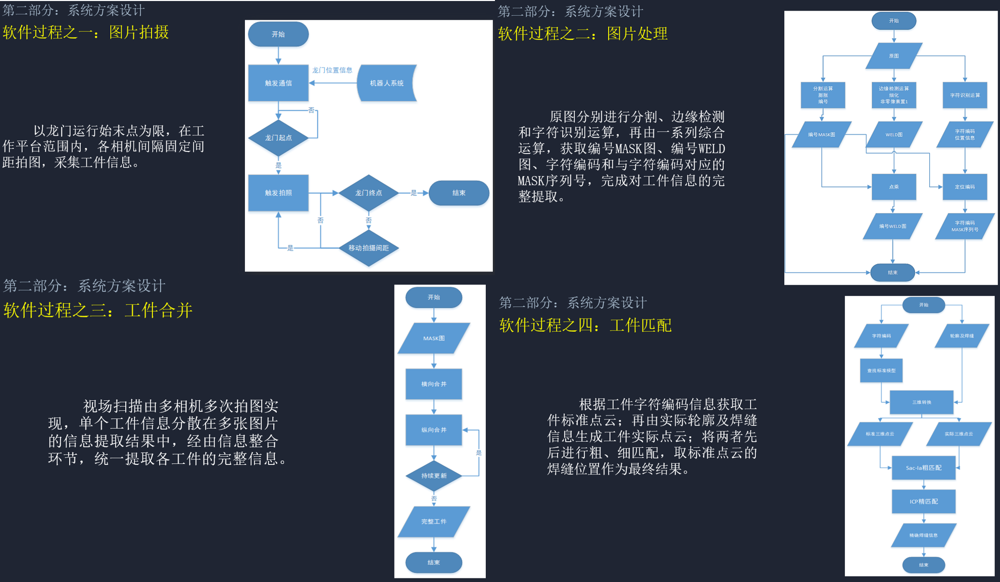

# Intelligent automated welding production line vision system.

智能自动化焊接生产线视觉系统

```
项目简介：
    本系统基于 Linux 系统、Qt 平台，旨在全自动完成金属工件的自动化焊接。
    1.多个相机并行情况下，利用图像分割算法、边缘检测算法提取工件 2D 特征位置。
    2.通过手眼转换将 2D 特征位置至焊接机器臂坐标系下形成 3D 点云。
    3.在该坐标系下对各个时间戳拍摄到的点云按连通方式合并，获取单工件的特征点云。
    4.应用字符识别提取工件名称，获取库中对应工件的对应真实点云。
    5.最后对真实与拍摄的点云进行配准，求取工件的焊接部位真实位置。
项目所需技能：
    Qt、c++、opencv、matlab、深度学习。
个人工作：
    a.调用相机、机械臂 API。标定并统一坐标系。
    b.图像处理程序。基于深度学习的轻量化 ERFNet 图像分割。
    c.针对 3D 点云数据设计点云合并算法。
    d.合并完成的点云与对应真实点云的配准算法。
    e.Qt 程序的部分图形化操作界面。
```

# NJUST2+3
NJUST2+3 is the project file at that time. Based on linux system and Qt platform implementation.

NJUST2+3 即为当时的工程文件。基于linux系统,Qt平台实现。

# code root explain
文件结构简要解释
```
NJUST2+3/
   camera(basler相机调用sample)
   compute(被imageprocessing调用，以前版本的源码)
   imageprocessing(现行代码部分，包含分割、轮廓提取、字符识别、点云合并、配准)
   ...(程序图形化操作界面以及通信所需源码)
```

# Principle
该项目原理word介绍与演示ppt可以从以下链接获取。

In 2020s, we relied on this project to participate in the research competition, and I participated in writing corresponding detailed technical papers and demonstration ppt.
Specific information can be found [here](https://pan.baidu.com/s/1PuQ9nNzDlcY0jpMucEI9Bw), key is y1za.

当时有依托这个项目参加研电赛，有参与写过相应详细的技术论文和演示ppt。具体百度云链接：
链接：https://pan.baidu.com/s/1PuQ9nNzDlcY0jpMucEI9Bw 
提取码：y1za 

# All steps
The following will illustrate all the steps
以下介绍该项目运行流程

# step1.photoing
龙门架在导轨上平移，携带相机拍摄工件

使用的了通信模块
<div align="center">
  
</div>

# step2.Program running
程序对拍摄的的工件就行处理

使用到了1.图像分割模块、2.轮廓提取模块、3.字符检测模块、4.工件合并模块、5、工件配准模块。
<div align="center">
  
</div>

# step3.matching
工件点云合并好的匹配流程

这是step2中的匹配片段，但具有代表性，故将其独立处理
<div align="center">
  
</div>

# step4.welding
机械依照程序计算的结果进行焊接

焊接示意
<div align="center">
  
</div>

# step5.Usage hint
使用场景示意，龙门架在导轨上扫面整个视场，携带的相机拍摄工件图片，程序处理后返回焊点坐标，龙门机器人依据坐标焊接。
<div align="center">
  
</div>
# 
# Processing analysis
具体模块流程、原理分析
# Processing1.Flow chart of each part
各部分流程图
<div align="center">
  
</div>

# Processing2.Underlying algorithm
各部分流程图
<div align="center">
  
</div>

