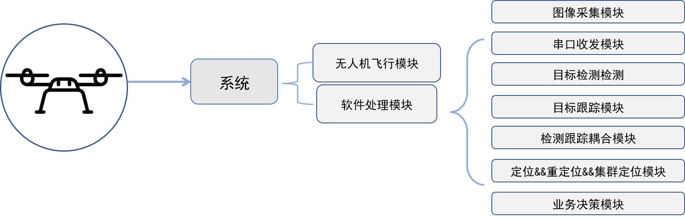
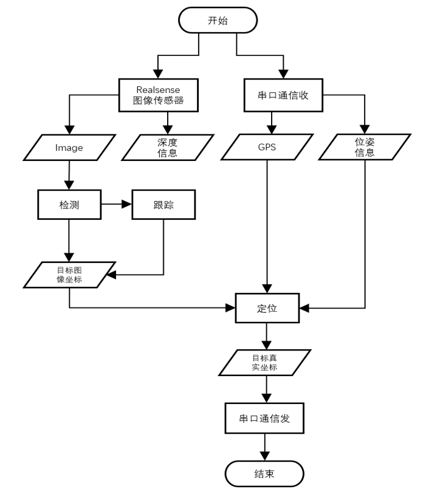
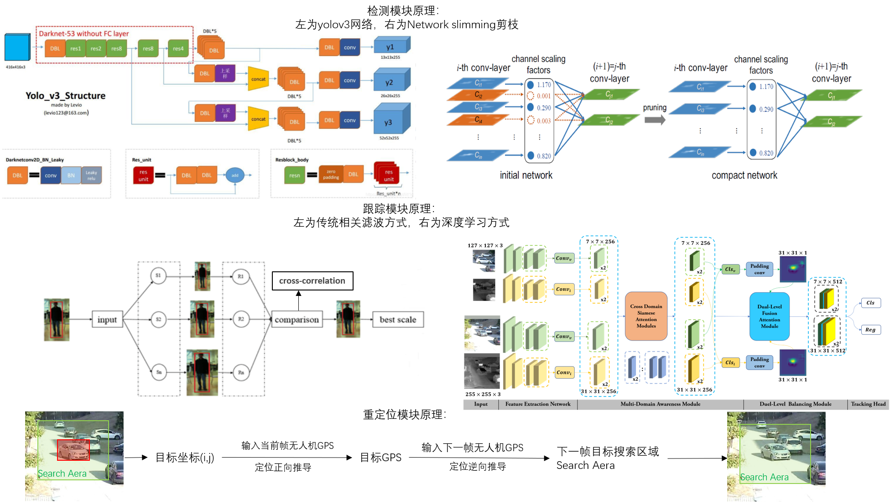

# UAV Locking Strike System无人机定点抛投打击系统
无人机定点抛投打击系统

```
项目简介：
        本系统基于 Linux 系统、Qt 平台，旨在全自动完成对目标无人化远程打击。
        1.无人机携带 TX2 核心板和 Realsense 相机，约定串口协议与无人机飞控通信。
        2.在高处，检测算法提取目标整体，通过检测、跟踪耦合算法锁定打击对象。
        2.1 通过串口收 GPS、姿态信息，计算目标的定位结果，再通过串口发出结果。
        3.在低处，二次检测提取对象的细节部位，通过检测、跟踪耦合算法锁定打击对象。
        3.1 通过 Realsense 相机获取深度图修正定位距离，转发飞控。
项目所需技能：
        Qt、c++、opencv、matlab、深度学习、TensorRT 加速、onnx。
个人工作：
        a.调用 Realsense 深度相机、串口 API，调整搭建无人机系统。
        b.利用 GPS 与姿态角统一至地理坐标系的目标定位算法，与目标出视场的重定位算法。
        c..部署剪枝后的 yolov3 目标检测算法。
        d.基于相关滤波与基于深度学习的双模 SiamDMA 目标跟踪算法。
        e.针对多机多目标的集群分配打击算法。
```
以下将为有三个部分的说明，分别是：

1.Directory structure explanation文件结构简要解释

2.Processing analysis具体模块流程、原理分析

3.All steps实际运行流程

# Directory structure explanation文件结构简要解释

# v132：
最开始构建该项目所使用的代码。可正常使用。
不过缺点有：

1、以一个结构体承载数据传输。这与面向对象编程的指导原则背道而驰。

2、线程的构建依靠c++的thread构建线程，以锁或者flag标志位作为线程的下一次循环条件。这损失了很多cpu资源。

3、最开始一些源码传承于上上届师兄的无人机项目，代码编写仍非常不规范，很多地方的源码耦合度非常高，想动就必须拆，很难保持开闭原则。

# v403:
对1系列的项目的缺点的更改。修改了v132中缺点1，3条。

修改对应条目1：将数据传输改为单类与单类数据传递，避免使用一个庞大的结构体。

修改对应条目3：将能解耦的代码解耦，新增代码尽量闭合源码。

# v301test:

对1系列的项目所有的缺点的更改。修改了v132中缺点1，2，3条。 由于当前该项目正在使用该代码，与师兄老师协商后认为与合作方签署保密协议，故理应保密，非常抱歉这里只放了一个很久之前的测试。

修改对应条目1：使用信号与槽替代数据传输。

修改对应条目2：该系列直接使用qt自带的线程qthread，一个类作为一个对象，有需要就将该类moveto一个线程。

修改对应条目3：将能解耦的代码解耦，新增代码尽量闭合源码。

# Processing analysis具体模块流程、原理分析
具体模块流程、原理分析

# Processing1.Flow chart of each part整体及各部分流程图
包含模块
<div align="center">
  
</div>

整体流程图
<div align="left">
  
</div>


# Processing2.Underlying algorithm各部分原理图
各部分原理图
<div align="center">
  
</div>

# Processing3.source可获取的更多信息
该项目原理word介绍与演示ppt可以从以下链接获取。

In 2020s, we relied on this project to participate in the research competition, and I participated in writing corresponding detailed technical papers and demonstration ppt.
Specific information can be found [here](https://pan.baidu.com/s/1nkvOiiUvk2WZnTMnjLa57g), key is idah.


当时有依托这个项目参加研电赛，有参与写过相应详细的技术论文和演示ppt。具体百度云链接：
链接：https://pan.baidu.com/s/1nkvOiiUvk2WZnTMnjLa57g 
提取码：idah 


# All steps实际运行流程
The following will illustrate all the steps
以下演示该项目实际运行流程

# step1.Program running effect 程序全程跟踪检测效果
无人机随航线飞行至目标上方50米区域寻找目标，找到目标后，向目标飞行，利用检测与跟踪的耦合算法持续锁定打击目标，飞至上方完成抛投或定点打击后返航。

使用的了通信模块
<div align="center">
  
</div>

# step2.Throwing effect定点抛投效果
程序控制无人机飞至目标上方，并将所携带炸药套至目标的定点抛投效果

使用到了1.图像分割模块、2.轮廓提取模块、3.字符检测模块、4.工件合并模块、5、工件配准模块。
<div align="center">
  
</div>

# step3.Throwing attack effect定点打击效果
程序控制无人机飞至目标上方，并快速降落至目标的定点打击效果

<div align="center">
  
</div>

