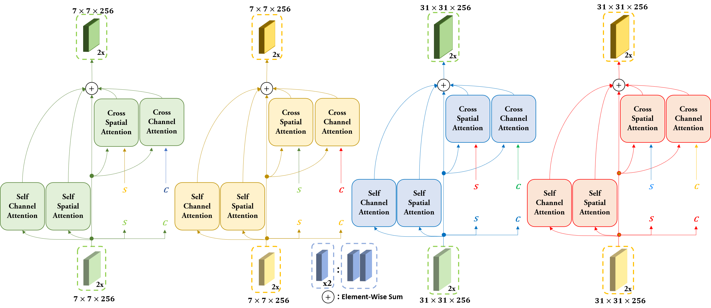

# siamdma folder.  
It's the code corresponding to the paper.

# siamdma.pdf. 
It's the original version of the paper.

  
The overall structure of SIAMDMA

  

  
Cross Domain Siamese Attention Module

  

  
Dual-Level Fusion Attention Module

  

