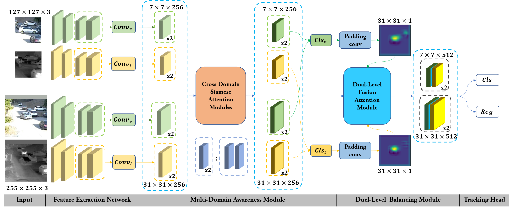
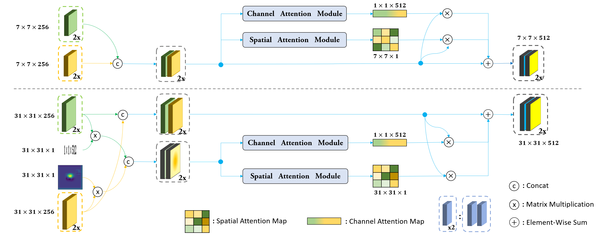

# siamdma folder.  
It's the code corresponding to the paper.

# siamdma.pdf. 
It's the original version of the paper.

# The structures of SIAMDMA
1.The overall structure of SIAMDMA

  

2.Cross Domain Siamese Attention Module

  

3.Dual-Level Fusion Attention Module

  

