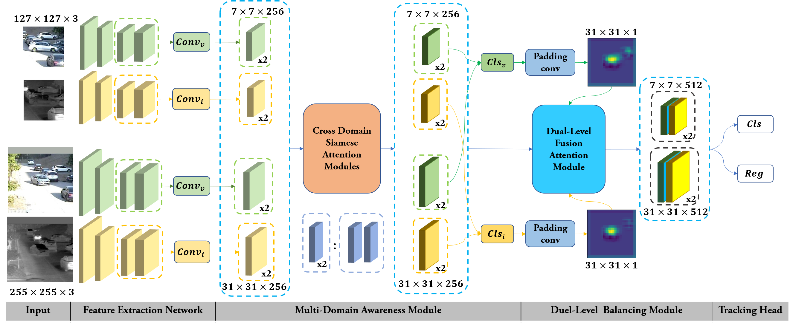
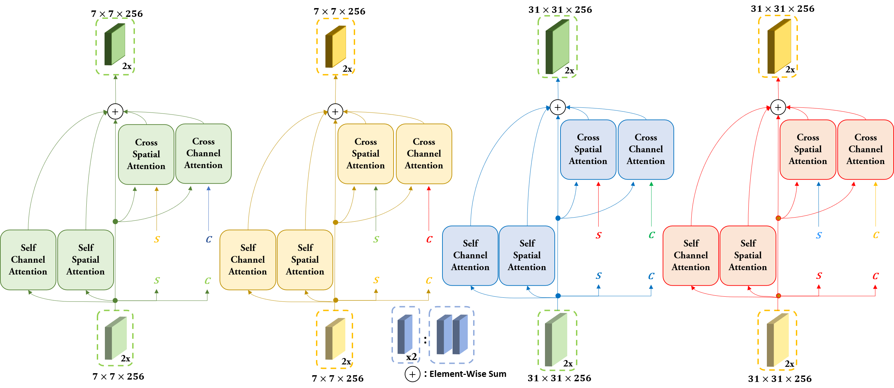
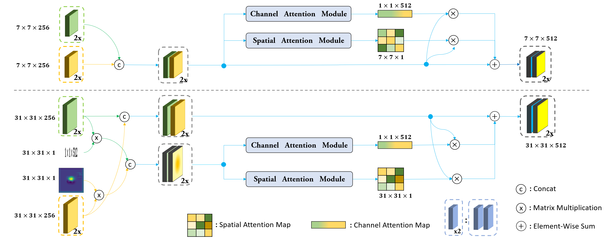

# SiamDMA 

# Examples of SiamDMA outputs.
1.section1
<div align="center">
  
</div>
2.section2
<div align="center">
  
</div>


# The structures of SIAMDMA
1.The overall structure of SIAMDMA
<div align="center">
  
</div>

2.Cross Domain Siamese Attention Module
<div align="center">
  
</div>

3.Dual-Level Fusion Attention Module
<div align="center">
  
</div>


# Quick Start: Using SiamDMA
Siamdma.pdf is the original version of the paper.

# 1.Run on the latest version of pytorch

# 2.prepare training dataset

1.Put it in any folder, as for me , I named one folder as dbpath。
The folder structure is：
```
    dbpath  /   dataset1
            /   dataset2
            /   ...
```

```
[got10k]链接: https://pan.baidu.com/s/1Zd1OnGZeH4koA3z6Usx3Bg  密码: tmjh
[LASOT]链接: https://pan.baidu.com/s/1BwsAmubB_itmREn3w2V-nQ  密码: qtd6
[LasHeR_fixed]链接: https://pan.baidu.com/s/1mgwc42LNFZm3bUFVdTGu1g  密码: f2vu
[rgbt234]链接: https://pan.baidu.com/s/1tFk3ewjwZHQhQ0lkN8KKfw  密码: sl8g
[GTOT]链接: https://pan.baidu.com/s/11xz-v2Q1EvJ-7vtp6ugd3Q  密码: we0u
```


2.Data standardization processing
Use the following python files to complete processing
Pay attention to modifying input and output in those files
```
.(siamdma)  /   data    /   prepareDataStanderd /
                                prepareDATAGOT10K.py
                                preparedataGTOT.py
                                ...
                                
python data/prepareDataStanderd/prepareDATAGOT10K.py
...

```


# 3.prepare pretrain_models 
```
[pretrain_models]链接: https://pan.baidu.com/s/1Xqp38CrO5NZ-RSITONUyNg  密码: t7ar
```

put it in ./


# 4.training
use ./bin/train.py to train our model
Pay attention to modifying the dbpath and jsonpath  
```
python bin/train.py
```


# 5.eval
```
python bin/eval.py
```

# 6.test
It will be updated soon, before October.


# 6.logger & lmdb & visdom 
They are already embedded in the framework

logger in ./util/funcs.py

lmdb in each prepareDataStanderd files

visdom in ./util/funcs.py

You can adjust the program to use them
