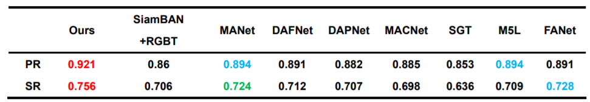
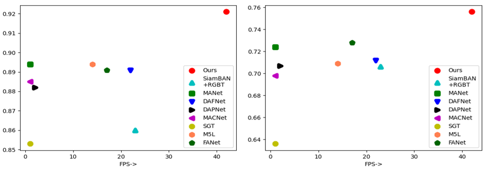
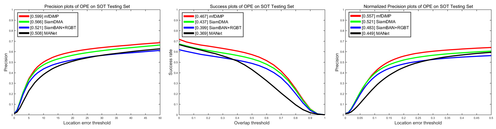

# projects_in_master_period
Graduate stage part of the works introduction, in order to let HR or readers can simply know me a little bit.

毕业阶段部分作品介绍，为了让HR或者读者可以简单的了解一下我。

Email: he_fengchen@qq.com

以下内容分为三部分介绍：
```
1project
    智能自动化焊接生产线视觉系统
2project
    无人机定点抛投打击系统
3article
    SiamDMA:Siamese Dual-level And Multi-domain Fusion Attention Network for RGBT Tracking
    双级多域孪生双模跟踪器
```

# 1.project  
Intelligent automated welding production line vision system.

智能自动化焊接生产线视觉系统
```
项目简介：
    本系统基于 Linux 系统、Qt 平台，旨在全自动完成金属工件的自动化焊接。
    1.多个相机并行情况下，利用图像分割算法、边缘检测算法提取工件 2D 特征位置。
    2.通过手眼转换将 2D 特征位置至焊接机器臂坐标系下形成 3D 点云。
    3.在同一坐标系下对各个时间戳拍摄到的点云按连通方式合并，获取单工件的特征点云。
    4.应用字符识别提取工件名称，获取库中对应工件的对应真实点云。
    5.最后对真实与拍摄的点云进行配准，求取工件的焊接部位真实位置。
```
1.1Examples of welding. 焊接结果演示

Welding results after the program is run
<div align="center">
  
</div>

1.2Program running process 程序运行演示

Program running process
<div align="center">
  
</div>

# 2.project  
UAV Locking Strike System

无人机定点抛投打击系统
```
项目简介：
    本系统基于 Linux 系统、Qt 平台，旨在全自动完成对目标无人化远程打击。
    1.无人机携带 TX2 核心板和 Realsense 相机，约定串口协议与无人机飞控通信。
    2.在高处，检测算法提取目标整体，通过检测、跟踪耦合算法锁定打击对象。
    2.1 通过串口收 GPS、姿态信息，计算目标的重定位防抖结果，再通过串口发出结果。
    3.在低处，二次检测提取对象的细节部位，通过检测、跟踪耦合算法锁定打击对象。
    3.1 通过 Realsense 相机获取深度图修正定位距离，转发飞控。
```

2.1Throwing effect 定点抛投效果演示

Locking Throwing effect
<div align="center">
  
</div>

2.2Program running effect 程序全程跟踪检测效果演示

无人机随航线飞行至目标上方50米区域寻找目标，找到目标后，向目标飞行，利用检测与跟踪的耦合算法持续锁定打击目标，飞至上方完成抛投或定点打击后返航。

<div align="center">
  
</div>

# 3.article  
SiamDMA: Siamese Dual-level And Multi-domain Fusion Attention Network for RGBT Tracking

应用于双模态跟踪的双级多域融合注意力孪生网络
```
SiamDMA: Siamese Dual-level And Multi-domain Fusion Attention Networkfor RGBT Tracking
双级多域孪生双模跟踪器简介：
    本方法基于 linux 系统，pytorch 框架，旨在引入红外模态提升跟踪器性能。
    1.依照 self-attention，适配在跨模态跨时域场景，形成跨模孪生 attention，微调跟踪模板，实现特征增强。
    2 增加可见光和红外模态的单独分类约束，避免陷入预训练时的局部最优。
    3.结合分类结果与双模特征，从特征级和决策级共同决定合并特征的重要程度。
    4 通过 anchor-free 方式回归当前帧的目标所在位置。分类使用交叉熵 loss，回归使用iouloss。
```

3.1Examples of SiamDMA outputs.SiamDMA的跟踪效果

1.section1

片段1
<div align="center">
  
</div>

2.section2

片段2
<div align="center">
  
</div>

3.2 Compare with those SOTA RGBT trackers.在双模测试数据集上最新的SOTA结果进行比较。

1.GTOT
<div align="center">
  
  
</div>
2.LasHeR
<div align="center">
  
</div>


# timeline


#0819 (overdue)

This is a temporary repository established when looking for a job. Store some schematic information. It is still under construction.

这是找工作时暂时建立的一个存放库。存放一些示意信息。仍在建设中。

#0919

When I interviewed Dahua Company on September 18, the HR told me not to fill the GITHUB link if there was just some schematic information.
I've been studying LeetCode for a while and have ignored the importance of github content for interviews. Thanks to the unknown DaHua HR for his reminding. Therefore, I decided to enrich my content today.

在9月18日面试大华公司的时候，HR告诉我如果只有一些示意信息，就不用填写GITHUB链接。
因为论文写完再8月中旬了，刷题起步太晚，就之前一段时间基本都在刷leetcode，忽略了github内容对面试的重要性。感谢不知名的大华HR的提醒。所以我决定今天充实我的内容。

#0919-0922

尽我所能爆肝补充了三个项目内容。后面在找工作期间，会通过与面试官的指导交流更新。

